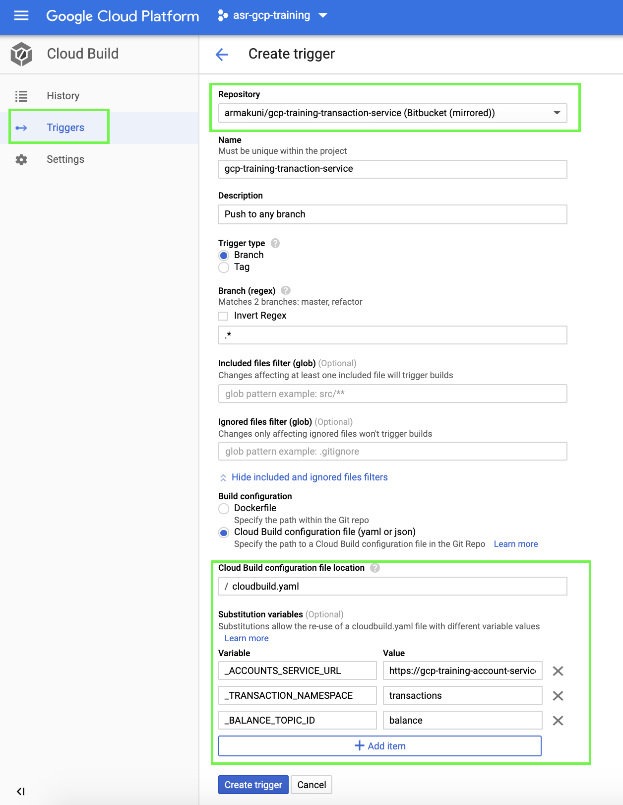

# Transaction Services

Transaction service for handling the transactions published by the Cashier service.

This service exposes an POST REST API : http://localhost:5002/transactions.

So whenever Cashier service pushes the transaction message to PubSub "transaction" topic then the PubSub Subscription listens to it and invokes the Transaction Endpoint with transaction message.

Once the transaction is received, transaction data is first stored in the Firestore Database and based on the transaction type the balance is calculated.

The balance data is published to another PubSub topic to be later updated by the balance service.

### Environment variables
The following environment variables are used by application:
```
TRANSACTION_NAMESPACE(Firestore Collection Name)=transactions(default)
BALANCE_TOPIC_ID(PubSub Topic ID)=balance(default)
ACCOUNTS_SERVICE_URL(Accounts Service URL)=http://localhost:5001/accounts/(default)
PORT=5002(default)
```

### Requirements
- A Firestore instance up and running in your Google Cloud account
- A Google service account to access the Firestore and PubSub

### To run linter
```bash
make lint
```

### To run tests
```bash
make test
```

### To run the service locally
Before starting the application locally you must create Google Service Account and store credentials json file locally to authenticate.

Once you have stored the credentials locally, export it to the environment variable as below:
```bash
export GOOGLE_APPLICATION_CREDENTIALS=[PATH_TO_CREDENTIALS_FILE]/[SERVICE_ACCOUNT_CREDENTIALS_FILENAME].json 
```

```bash
make run
```

#### DO NOT STORE THE CREDENTIALS FILE INSIDE THE REPOSITORY
It is strongly recommended not to store the credentials in the repository as this might lead to a security risk. Unless the file is encrypted, it could be exposed when pushed up if the repository is public, or if the repository is used to create a container image which is stored publicly.

### Deployment

#### CLI Deployment
This repository contains a cloudbuild.yaml file to deploy service on to Cloud Run.

To validate the account for which the "debit" or "credit" transactions are requested this service requires "Accounts Service URL" which can be retrieved from the Cloud Run console.
Note: Do not add ```'\accounts\'```` or any other parameter to the URL.

Execute the below command to trigger a Cloud Build Deployment after replacing the substitution variables with appropriate values.

```bash
gcloud builds submit --substitutions=_ACCOUNTS_SERVICE_URL="[ACCOUNTS_SERVICE_URL]",_TRANSACTION_NAMESPACE="[TRANSACTION_NAMESPACE]",_BALANCE_TOPIC_ID="[BALANCE_TOPIC_ID]"
```

where [ACCOUNTS_SERVICE_URL] is the URL of the account service,[TRANSACTION_NAMESPACE] is the name of the Firestore collection that stores the transaction information and [BALANCE_TOPIC_ID] is the PubSub topic id to which the balance update message will be pushed.

If you observe the [cloudbuild.yaml](/cloudbuild.yaml) closely you will identify there is another step declared which creates a PubSub Subscription and links the Transaction Service URL once the Transaction Service is deployed.

* Makes sure that variable name matches with what is been defined in the "cloudbuild.yaml". If you wish to change the variable name then you must replace all the respective references in the [cloudbuild.yaml](/cloudbuild.yaml) as well.
* If you do not specify the substitution parameters (to know more about substitutions [click here](https://cloud.google.com/cloud-build/docs/configuring-builds/substitute-variable-values)) the clouldbuild will use default value specified in the CloudBuild.yaml under substitution section.

#### Setup Cloud Build Trigger to deploy Microservice on each commit

Now let us set up a Cloud Build Trigger to deploy the changes automatically with each commit.

1. Navigate to the Cloud Build page in the console and click ```Triggers```
2. Click ```Create Trigger``` and should open a new page.
3. Enter all the information highlighted in the below image.
4. Set the substitutions variables appropriately (preferably the same as the CLI step). As explained earlier if you wish you change the variable name you must change in the "cloudbuild.yaml" as well.
5. The values specified here will override any default values defined in the "cloudbuild.yaml". If you wish to change the value make a note of it.



6. Click Create Trigger and your trigger should be ready to use.
7. Make a commit and observe Cloud Build to confirm the trigger is working fine.

### API documentation

You can access the API documentation by launching the application and visiting [swagger ui](http://localhost:5002/docs/)
